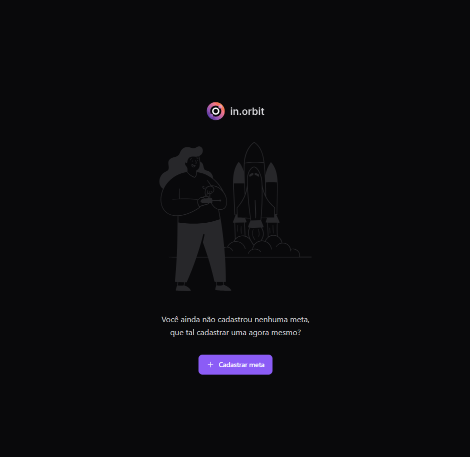
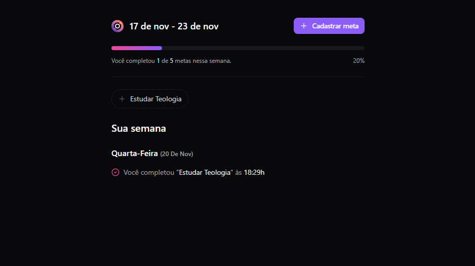
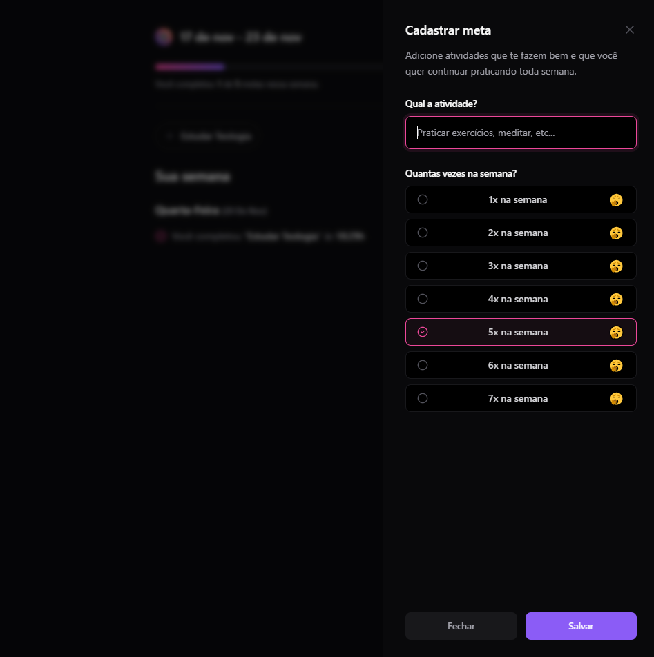

<h1 align="center">JS Pocket In.Orbit (React.JS)</h1>

Getting Started

```SH
npm install
npm run dev
```

Final result

<div align="center">
  
  <p><i>Without "Goals" created</i></p>
  
  <p><i>"Goals" and "Pending Goals"</i></p>
  
  <p><i>Creating a "Goal"</i></p>
</div>

<br>
<div align="center">
  <h2>Thanks 4 everyone!</h2>
  <p>Made w/ 💙 by <a href="https://github.com/pratesMath">pratesMath</a>.</p>
</div>
